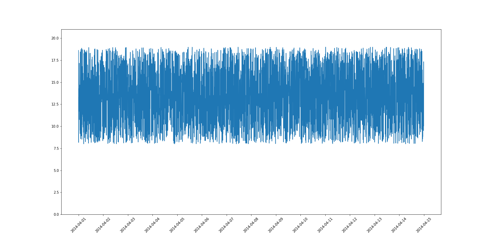
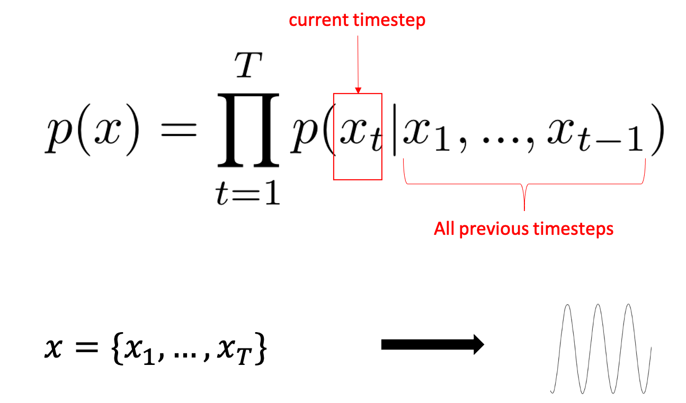

# Time Series Anomaly Detection Challenge 

Below is a brief description of the data: 

## Training Data  Description
### `training_1.csv`

| Label | # Examples |
|-------|------------|
| 0     | 4032       |
| 1     | 0          |

### `training_2.csv`

| Label | # Examples |
|-------|------------|
| 0     | 3760       |
| 1     | 272        |

### `training_3.csv`

| Label | # Examples |
|-------|------------|
| 0     | 4032       |
| 1     | 0          |

### `training_4.csv`

| Label | # Examples |
|-------|------------|
| 0     | 3772       |
| 1     | 260        |

### `training_5.csv`

| Label | # Examples |
|-------|------------|
| 0     | 16991      |
| 1     | 1059       |

### `training_100.csv`

| Label | # Examples |
|-------|------------|
| 0     | 19469      |
| 1     | 690        |

* The imbalanced label distribution means that we can try some classification algorithms with techniques to combat the imbalanced dataset but we should also try some semi-supervised (only trained on normal examples) algorithms too. *

* The scales of the data are also extremely different, we should experiment with different normalisation/standardisation techniques. We will need to decide what the most realistic way to do this would be. 

## Preprocessing
#### Windowing

#### Normalisation
TODO. 

## Misc.
Some points mentioned in the brief. 
> For an incident contains a number of continuous anomaly points, first N (<10) will give double points in the accuracy calculation

Need to figure out what the above means. 

>For detecting any anomaly of a timestamp, only data before the timestamp is allowed to be used for the input of the algorithm

This is important, it means we are confined to autoregressive-type algorithms. i.e. we window data with the label we are predicting being offset by one. So **no looking into the future!**

> Manual algorithm parameter tuning are allowing for the whole dataset, but not allowed for each individual dataset.

So can only have one model with one set of parameters for all individual datasets from my reading of this. 

## Baseline. 
OC-SVM 
> sklearn version implemented (vanilla version, no paramaters tuned).
> F1 scores calculated.
> A worryingly large number of False Positives.
> In its current form this may be looking into the future. Need expert confirmation here. 
> I'm wondering if we can train our models on datasets elsewhere with similar properties to the challenge data. Some form of transfer learning.  

